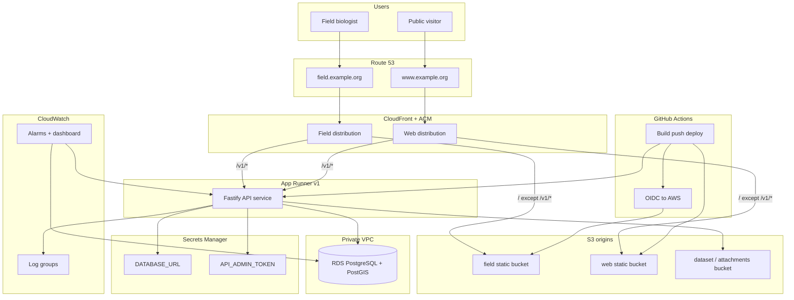
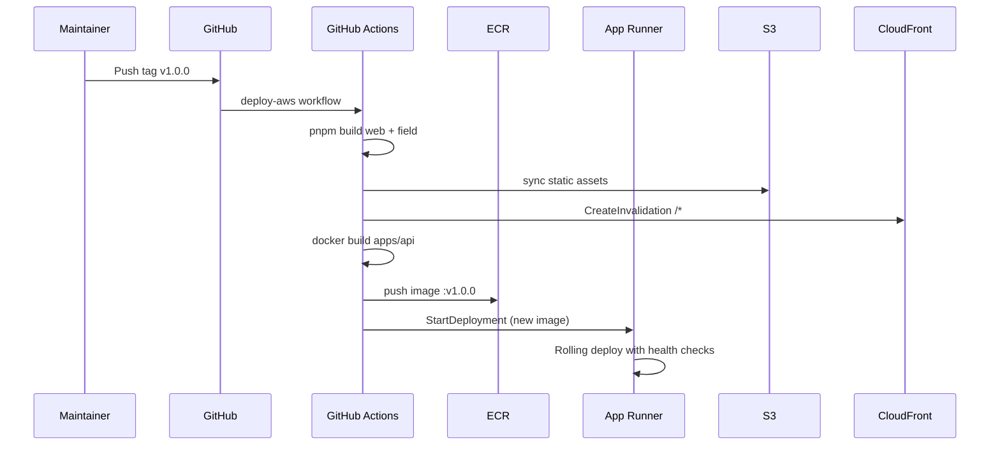

# AWS infrastructure layout (MMAP)

Sketch for staging and production on AWS. Implements M5 goals: managed PostgreSQL, S3 object storage, static frontends, containerized API, GitHub-driven deploys, and a path to blue/green canary on the API.

## Architecture



### Design choices

| Decision          | v1 (this sketch)                                                              | Upgrade path                                                    |
| ----------------- | ----------------------------------------------------------------------------- | --------------------------------------------------------------- |
| API compute       | **App Runner** — low ops, health-checked rolling deploy                       | **ECS Fargate + CodeDeploy** for native canary traffic shifting |
| Database          | **RDS PostgreSQL** (`db.t4g.micro` staging, `db.t4g.small` prod) with PostGIS | Aurora Serverless v2 if sync volume grows                       |
| Frontends         | **S3 + CloudFront** (build artifacts from CI)                                 | Same; invalidate cache on deploy                                |
| Object storage    | **S3** (dataset exports, future attachments)                                  | Lifecycle rules to Glacier for old snapshots                    |
| Same-origin `/v1` | CloudFront **path behavior** proxies API                                      | Keeps field PWA working without `VITE_API_BASE_URL`             |
| Secrets           | **Secrets Manager**                                                           | Rotation for DB password via RDS integration                    |
| IaC               | **Terraform** modules under `infra/terraform/`                                | Remote state in S3 + DynamoDB lock table                        |

### Why CloudFront path routing for `/v1`

Docker/nginx today proxies `/v1` to the API so browsers use same-origin requests. Replicate that at the edge:

- `field.example.org/*` → S3 (field PWA)
- `field.example.org/v1/*` → App Runner API origin
- Same pattern for the public web distribution

Leave `VITE_API_BASE_URL` **unset** in field/web production builds so the app continues to call relative `/v1/...` URLs.

### Network

```
VPC 10.0.0.0/16
├── public subnets (2 AZ)     — NAT gateway (optional v1; App Runner egress is managed)
├── private subnets (2 AZ)    — RDS only
└── App Runner VPC connector  — ENIs in private subnets → RDS security group :5432
```

RDS is not publicly accessible. App Runner reaches it through the VPC connector.

## Environments

|                     | Staging                        | Production                        |
| ------------------- | ------------------------------ | --------------------------------- |
| Terraform workspace | `staging`                      | `production`                      |
| API service         | `mmap-api-staging`             | `mmap-api`                        |
| RDS instance        | `db.t4g.micro`, single-AZ      | `db.t4g.small`, multi-AZ optional |
| CloudFront          | `field-staging.*`, `staging.*` | `field.*`, `www.*`                |
| Deletion protection | off                            | on                                |
| Backup retention    | 7 days                         | 30 days                           |

## Repository layout

```
infra/
├── README.md                          Quick start for operators
└── terraform/
    ├── README.md
    ├── versions.tf                    Provider pins
    ├── modules/
    │   ├── networking/                VPC, subnets, SGs, App Runner connector
    │   ├── database/                RDS PostgreSQL + PostGIS parameter group
    │   ├── storage/                 S3 buckets (web, field, dataset)
    │   ├── api/                     ECR repo + App Runner service + IAM
    │   ├── cdn/                     CloudFront + ACM + Route 53 records
    │   ├── monitoring/              CloudWatch logs, alarms, dashboard
    │   └── github-oidc/             IAM role for GitHub Actions deploy
    └── environments/
        ├── staging/
        │   ├── main.tf                Composes modules
        │   ├── variables.tf
        │   ├── outputs.tf
        │   ├── terraform.tfvars.example
        │   └── backend.tf.example     S3 remote state template
        └── production/
            └── (same structure)

.github/workflows/
└── deploy-aws.yml                     Deploy on release tag (sketch)

docs/ops/
├── AWS_INFRA.md                       This document
└── DEPLOYMENT.md                      Promotion checklist & runbooks
```

## Module responsibilities

### `networking`

- VPC, public/private subnets across 2 AZs
- Security groups: `api-connector-sg`, `rds-sg`
- App Runner VPC connector

### `database`

- RDS PostgreSQL 16, parameter group enabling `postgis`
- Subnet group (private subnets)
- Automated backups, encryption at rest
- Outputs: endpoint (sensitive), database name

### `storage`

- `mmap-{env}-web-static` — public read via CloudFront OAC
- `mmap-{env}-field-static` — public read via CloudFront OAC
- `mmap-{env}-data` — private; API IAM role read/write for exports/attachments
- Versioning on data bucket; lifecycle for old dataset snapshots

### `api`

- ECR repository for `apps/api` image
- App Runner service:
  - Image from ECR `:latest` or digest-pinned tag
  - VPC connector → RDS
  - Environment from Secrets Manager references
  - `CORS_ORIGIN` = field + web CloudFront URLs
  - Health check path `/v1/health`
  - Auto-deployments **disabled** in production (CI triggers deployment explicitly)
- IAM role: S3 data bucket access, Secrets Manager read, CloudWatch logs

### `cdn`

- ACM certificates (DNS validation in Route 53; **us-east-1** provider alias for CloudFront)
- Two CloudFront distributions (web, field) with:
  - Default behavior → S3 OAC origin
  - `/v1/*` behavior → App Runner origin (HTTPS only)
  - `/openapi*` → API origin (web only)
- Route 53 A/AAAA alias records

### `monitoring`

- Log groups: `/mmap/{env}/api`
- Alarms: API 5xx rate, App Runner health check failures, RDS CPU/storage/freeable memory
- Optional: CloudWatch Synthetics canary hitting `/v1/health`
- Dashboard: sync-relevant metrics (custom metric from API logs later)

### `github-oidc`

- IAM OIDC provider for `token.actions.githubusercontent.com`
- Role assumable by `SaveMarineMammals/marine-mammal-assessment-platform` on `ref:refs/tags/v*`
- Policies: ECR push, App Runner `StartDeployment`, S3 sync to static buckets, CloudFront invalidation

## CI/CD flow



**Staging:** deploy on push to `main` (optional workflow) or manual `workflow_dispatch`.

**Production:** deploy on semver tag `v*` after staging verification.

Database migrations run before API rollout. The deploy workflow reads **`DATABASE_SECRET_ARN`** (RDS-managed Secrets Manager secret) — not a plaintext URL in GitHub:

```powershell
# deploy-aws.yml (simplified)
$env:DATABASE_URL = aws secretsmanager get-secret-value --secret-id $env:DATABASE_SECRET_ARN ...
pnpm --filter @mmap/api db:migrate
```

The API accepts either a PostgreSQL URL (local/CI) or RDS Secrets Manager JSON in `DATABASE_URL`. See `apps/api/src/cli/database-url.ts`.

Never commit database credentials to the repository or Terraform state.

## Blue/green and canary (phase 2)

App Runner v1 uses **rolling deployment** with health checks — sufficient for M5 launch.

For canary traffic shifting on the API:

1. Introduce an **Application Load Balancer** in front of two ECS Fargate target groups (blue/green).
2. Use **CodeDeploy** `ECSAllAtOnce` or `Linear10PercentEvery1Minutes` deployment config.
3. Point CloudFront `/v1/*` origin at the ALB instead of App Runner.
4. Keep frontends on S3/CloudFront unchanged.

Static frontends already support safe rollback: redeploy previous S3 object version + CloudFront invalidation.

## Cost estimate (us-east-1, no credits)

| Resource        | Staging        | Production     |
| --------------- | -------------- | -------------- |
| RDS             | ~$15/mo        | ~$25–35/mo     |
| App Runner      | ~$5–10/mo      | ~$10–20/mo     |
| S3 + CloudFront | ~$2/mo         | ~$5/mo         |
| NAT (if added)  | ~$32/mo        | ~$32/mo        |
| **Total**       | **~$25–60/mo** | **~$45–90/mo** |

Skip NAT in v1 if App Runner VPC connector + public RDS access is not required (RDS stays private; connector handles API→DB).

Apply for **AWS Activate** (nonprofit) to offset year-one cost.

## Related docs

- [DEPLOYMENT.md](DEPLOYMENT.md) — promotion checklist and restore drill
- [../REQUIREMENTS.md](../REQUIREMENTS.md) — NFR and storage requirements
- [../../infra/README.md](../../infra/README.md) — Terraform operator guide
