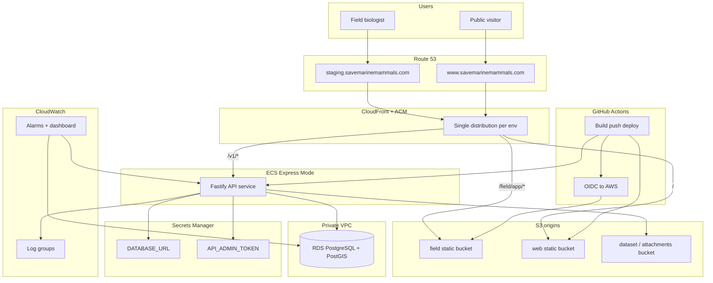
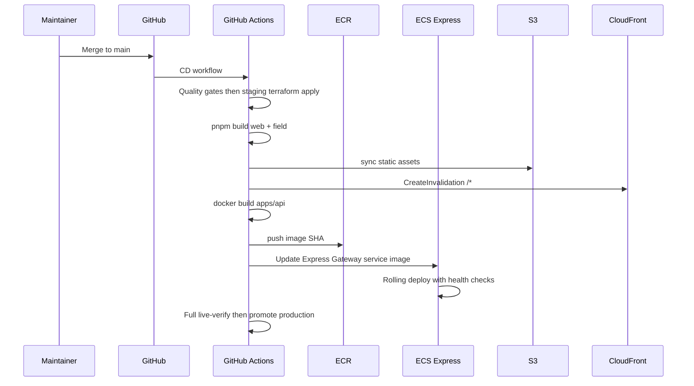

# AWS infrastructure layout (MMAP)

Sketch for staging and production on AWS. Implements M5 goals: managed PostgreSQL, S3 object storage, static frontends, containerized API, GitHub-driven deploys, and a path to blue/green canary on the API.

## Architecture


```mermaid
flowchart TB
  subgraph users [Users]
    FieldUser[Field biologist]
    PublicUser[Public visitor]
  end

  subgraph dns [Route 53]
    ProdWWW[www.savemarinemammals.com]
    StagingDNS[staging.savemarinemammals.com]
  end

  subgraph edge [CloudFront + ACM]
    SiteCF[Single distribution per env]
  end

  subgraph static [S3 origins]
    FieldBucket[field static bucket]
    WebBucket[web static bucket]
    DataBucket[dataset / attachments bucket]
  end

  subgraph compute [ECS Express Mode]
    API[Fastify API service]
  end

  subgraph data [Private VPC]
    RDS[("RDS PostgreSQL + PostGIS")]
  end

  subgraph secrets [Secrets Manager]
    DBSecret[DATABASE_URL]
    AdminSecret[API_ADMIN_TOKEN]
  end

  FieldUser --> StagingDNS
  PublicUser --> ProdWWW
  StagingDNS --> SiteCF
  ProdWWW --> SiteCF
  SiteCF -->|"/"| WebBucket
  SiteCF -->|"/field/app/*"| FieldBucket
  SiteCF -->|"/v1/*"| API
  API --> RDS
  API --> DataBucket
  API --> DBSecret
  API --> AdminSecret

  subgraph cicd [GitHub Actions]
    GHA[Build push deploy]
    OIDC[OIDC to AWS]
  end

  subgraph observe [CloudWatch]
    Logs[Log groups]
    Alarms[Alarms + dashboard]
  end

  GHA --> OIDC --> FieldBucket
  GHA --> WebBucket
  GHA --> API

  API --> Logs
  Alarms --> API
  Alarms --> RDS
```

### Design choices

| Decision          | v1 (this sketch)                                                              | Upgrade path                                                    |
| ----------------- | ----------------------------------------------------------------------------- | --------------------------------------------------------------- |
| API compute       | **ECS Express Mode** — AWS-recommended App Runner replacement; ALB + Fargate  | **ECS Fargate + CodeDeploy** for native canary traffic shifting |
| Database          | **RDS PostgreSQL** (`db.t4g.micro` staging, `db.t4g.small` prod) with PostGIS | Aurora Serverless v2 if sync volume grows                       |
| Frontends         | **S3 + CloudFront** (build artifacts from CI)                                 | Same; invalidate cache on deploy                                |
| Object storage    | **S3** (dataset exports, future attachments)                                  | Lifecycle rules to Glacier for old snapshots                    |
| Same-origin `/v1` | CloudFront **path behavior** proxies API                                      | Keeps field PWA working without `VITE_API_BASE_URL`             |
| Secrets           | **Secrets Manager**                                                           | Rotation for DB password via RDS integration                    |
| IaC               | **Terraform** modules under `infra/terraform/`                                | Remote state in S3 + DynamoDB lock table                        |

### Why CloudFront path routing for `/v1`

Docker/nginx today proxies `/v1` to the API so browsers use same-origin requests. Replicate that at the edge on a **single** hostname per environment:

- `www.savemarinemammals.com/` (or staging host) → S3 web
- `…/field/app/*` → S3 field PWA
- `…/v1/*` → ECS Express API origin

Leave `VITE_API_BASE_URL` **unset** in field/web production builds so the app continues to call relative `/v1/...` URLs.

### Network

```
VPC 10.0.0.0/16
├── public subnets (2 AZ)     — ECS Express tasks + managed ALB (IGW egress)
├── private subnets (2 AZ)    — RDS only
└── S3 gateway endpoint       — free; no interface PrivateLink endpoints
```

RDS is not publicly accessible. ECS Express tasks run in **public** subnets so the
managed ALB gets a public ingress endpoint (required for CloudFront `/v1/*`). Tasks
reach ECR, CloudWatch Logs, and Secrets Manager via the internet gateway — interface
VPC endpoints are omitted on purpose (they dominated the staging bill at ~$58/mo).

Do **not** add NAT gateways (~$32/mo each) unless tasks move to private subnets.

## Environments

|                     | Staging                                   | Production                                |
| ------------------- | ----------------------------------------- | ----------------------------------------- |
| Terraform workspace | `staging`                                 | `production`                              |
| API service         | `mmap-staging-api`                        | `mmap-production-api`                     |
| RDS instance        | `db.t4g.micro`, single-AZ                 | `db.t4g.small`, multi-AZ optional         |
| CloudFront          | off until account verified (`enable_cdn`) | off until account verified (`enable_cdn`) |
| Deletion protection | off                                       | on                                        |
| Backup retention    | 7 days                                    | 30 days                                   |

## CloudFront (`enable_cdn`)

Staging and production set `enable_cdn = true` so a **single** distribution serves the
mission site at `/` and the field PWA at `/field/app/`, with same-origin `/v1`.

New or unverified AWS accounts are sometimes blocked from creating CloudFront
distributions. If apply fails on distribution create, temporarily set
`enable_cdn = false` in that environment’s `terraform.tfvars`. Terraform still
provisions networking, RDS, ECS Express, S3, monitoring, and the deploy role
(skips `module.cdn`).

| Capability                    | With `enable_cdn = false`                                               |
| ----------------------------- | ----------------------------------------------------------------------- |
| Live API + RDS + sync testing | Yes — use `terraform output -raw api_service_url`                       |
| ECR image deploy / migrations | Yes                                                                     |
| S3 static sync                | Yes (artifacts only; no public CloudFront URL)                          |
| Same-origin field/web on AWS  | No — re-enable CDN after verification                                   |
| Browser field app → live API  | Set `VITE_API_BASE_URL` to the Express URL and `cors_origins` in tfvars |

After CDN is enabled (or re-enabled):

1. Confirm `enable_cdn = true` in `terraform.tfvars`
2. `terraform apply`
3. Store `WEB_CLOUDFRONT_ID` GitHub secret from `web_cloudfront_distribution_id` (single distribution)
4. Prefer same-origin field/web URLs (`/field/app/`); leave `VITE_API_BASE_URL` unset for production builds

Smoke tests always hit `api_service_url` (works with or without CDN). Deploy skips
CloudFront invalidation when `WEB_CLOUDFRONT_ID` is empty.

## Repository layout

```
infra/
├── README.md                          Quick start for operators
└── terraform/
    ├── README.md
    ├── versions.tf                    Provider pins
    ├── modules/
    │   ├── networking/                VPC, subnets, SGs, S3 gateway endpoint
    │   ├── database/                RDS PostgreSQL 16 + parameter group
    │   ├── storage/                 S3 buckets (web, field, dataset)
    │   ├── api/                     ECR + ECS Express + IAM + API log group
    │   ├── cdn/                     CloudFront (+ ACM/Route 53 when domains set)
    │   ├── monitoring/              CloudWatch alarms + dashboard
    │   └── github-oidc/             Per-env IAM deploy role (OIDC provider is bootstrap)
    └── environments/
        ├── staging/
        │   ├── main.tf                Composes modules
        │   ├── variables.tf
        │   ├── outputs.tf
        │   ├── terraform.tfvars.example
        │   └── backend.tf.example     S3 remote state template
        └── production/
            └── (same structure)

.github/workflows/
├── ci.yml                             PR quality + CodeQL + terraform plan
├── cd.yml                             Progressive staging → production CD
├── release-staging.yml                Manual staging infra+app+verify
└── _deploy-app.yml / _verify-env.yml  Reusable deploy and live-verify

docs/ops/
├── AWS_INFRA.md                       This document
└── DEPLOYMENT.md                      Promotion checklist & runbooks
```

## Module responsibilities

### `networking`

- VPC, public/private subnets across 2 AZs
- Security groups: `api-connector-sg`, `rds-sg`
- S3 gateway endpoint (no interface PrivateLink endpoints)
- Internet gateway for ECS task egress to AWS APIs

### `database`

- RDS PostgreSQL 16 (`db.t4g.micro` staging / `db.t4g.small` production), single-AZ
- Custom parameter group (`postgres16` family); PostGIS via extension in the database, not RDS parameters
- Subnet group (private subnets); not publicly accessible
- Automated backups, encryption at rest, RDS-managed master secret in Secrets Manager
- Outputs: `db_instance_id`, `database_url_secret_arn`, `database_secret_kms_key_arn`

### `storage`

- `mmap-{env}-web-static` — public read via CloudFront OAC
- `mmap-{env}-field-static` — public read via CloudFront OAC
- `mmap-{env}-data` — private; API IAM role read/write for exports/attachments
- Versioning on data bucket (no Glacier lifecycle rule yet)

### `api`

- ECR repository for `apps/api` image
- ECS Express Gateway service (managed ALB + Fargate):
  - Image from ECR (CI updates image; Terraform ignores image drift after create)
  - Tasks in public subnets; security group allows RDS :5432
  - Secrets Manager refs for `DATABASE_URL` and `API_ADMIN_TOKEN`
  - `CORS_ORIGIN` = site CloudFront URL (custom domain) when configured
  - Health check path `/v1/health`
  - Auto scaling: `min_task_count = 1` (use `staging-hibernate.ts` to override at runtime)
- CloudWatch log group `/{name_prefix}/api` (e.g. `/mmap-staging/api`)
- IAM roles: execution, infrastructure (Express), task (S3 data + secrets)

### `cdn`

- One CloudFront distribution (web + field) with:
  - Default behavior → S3 web bucket (`/`, `/app`, `/docs`, …)
  - `/field/app` and `/field/app/*` → S3 field bucket (keys under `field/app/`)
  - `/v1/*` and `/openapi*` → ECS Express API origin (HTTPS only)
  - CloudFront Function SPA fallback for web and field deep links; production apex → www 301
  - Response headers policy (HSTS) when a custom domain is configured
- Default CloudFront certificate when `domain_name` is empty
- When `domain_name` is set: shared bootstrap ACM (apex + wildcard), Route 53 aliases
  - Staging: `staging.savemarinemammals.com`
  - Production: `www.savemarinemammals.com` (canonical); apex redirects to www

### `monitoring`

- Alarms: ECS CPU high, RDS free storage low (names: `{name_prefix}-ecs-cpu-high`, `{name_prefix}-rds-low-storage`)
- Dashboard: `{name_prefix}-overview` (health-check URL text widget)
- API log group lives in the **api** module, not monitoring

### `github-oidc`

- Per-environment deploy role (`mmap-{env}-github-deploy`) that trusts the **shared** account OIDC provider created by bootstrap
- Policies: ECR push, ECS Express update/describe, S3 sync to static buckets, CloudFront invalidation

## CI/CD flow


```mermaid
sequenceDiagram
  participant Dev as Maintainer
  participant GH as GitHub
  participant GHA as GitHub Actions
  participant ECR as ECR
  participant ECS as ECS Express
  participant S3 as S3
  participant CF as CloudFront

  Dev->>GH: Merge to main
  GH->>GHA: CD workflow
  GHA->>GHA: Quality gates then staging terraform apply
  GHA->>GHA: pnpm build web + field
  GHA->>S3: sync static assets
  GHA->>CF: CreateInvalidation /*
  GHA->>GHA: docker build apps/api
  GHA->>ECR: push image SHA
  GHA->>ECS: Update Express Gateway service image
  ECS->>ECS: Rolling deploy with health checks
  GHA->>GHA: Full live-verify then promote production
```

**Staging:** CD on merge to `main`, or **Release staging** from a feature branch (infra + app + full live-verify).

**Production:** automatic CD promotion after staging full live-verify succeeds (smoke live-verify after production deploy).

Database migrations run on **API container startup** (before the process listens), so ECS health checks only pass after schema is applied. RDS is private, so GitHub-hosted runners cannot migrate directly.

ECS injects the RDS-managed Secrets Manager JSON into `DATABASE_URL` and sets non-secret `DB_HOST` / `DB_PORT` / `DB_NAME`. The API merges them via `apps/api/src/cli/database-url.ts`. Local/CI use a plain PostgreSQL URL.

Never commit database credentials to the repository or Terraform state.

## Blue/green and canary (phase 2)

ECS Express uses **rolling deployment** with health checks — sufficient for M5 launch.

For canary traffic shifting on the API:

1. Move from Express to an explicit Application Load Balancer with two ECS Fargate target groups (blue/green).
2. Use **CodeDeploy** `ECSAllAtOnce` or `Linear10PercentEvery1Minutes` deployment config.
3. Point CloudFront `/v1/*` origin at that ALB.
4. Keep frontends on S3/CloudFront unchanged.

Static frontends already support safe rollback: redeploy previous S3 object version + CloudFront invalidation.

## Cost model (us-east-1, measured July 2026)

Measured against a live **staging-only** stack (ECS Express + RDS + 4 interface VPC
endpoints). Interface PrivateLink was ~60% of spend and has been removed from the
networking module.

| Resource (per environment)                            | Approx $/mo | Notes                                                                  |
| ----------------------------------------------------- | ----------- | ---------------------------------------------------------------------- |
| Interface VPC endpoints (removed)                     | ~~$58~~ $0  | Do not re-add                                                          |
| ECS Express managed ALB                               | ~$16        | Bills even with 0 tasks                                                |
| RDS `db.t4g.micro` instance + 20 GB gp3               | ~$14        | ~$12 instance + ~$2 storage; prod uses `db.t4g.small`                  |
| Public IPv4                                           | ~$5–7       | Follows ALB / public ENIs                                              |
| Fargate 1 vCPU / 2 GiB (list, min 1 task)             | ~$36        | List price when a task runs; was $0 in July (no running tasks / trial) |
| S3 + CloudFront + Secrets + KMS                       | ~$2–5       | Low at pilot traffic                                                   |
| NAT (if added)                                        | ~$32 each   | Avoid                                                                  |
| **Always-on, no PrivateLink, task running (list)**    | **~$70–80** | ALB + RDS + IPv4 + Fargate list + misc                                 |
| **Always-on, no PrivateLink, measured Jul (0 tasks)** | **~$35–45** | ALB + RDS + IPv4 + misc; Fargate not billing                           |
| **Hibernated (0 tasks + RDS stopped)**                | **~$25**    | ALB + IPv4 + RDS storage only                                          |
| **Idle (stack destroyed)**                            | **~$0–2**   | Bootstrap state/locks only                                             |

**Operating model:** keep bootstrap (state bucket, lock table, OIDC) always on.
Treat staging **API + RDS + VPC** as ephemeral — apply when needed, destroy when idle.
See [Ephemeral staging](#ephemeral-staging) below and [infra/README.md](../../infra/README.md).

When a full teardown is too heavy, [hibernate staging](#hibernate-staging-scale-to-zero)
instead: scale API tasks to zero and stop RDS, leaving a ~$25/mo floor.

Apply for **AWS Activate** (nonprofit) to offset year-one cost when the stack is up.

## Ephemeral staging

Staging is not required 24/7 for a nonprofit pilot. Default practice:

1. **Create** when you need demos, UAT, or pre-production validation (`terraform apply` or **Release staging** workflow).
2. **Destroy** when idle so ALB + RDS + IPv4 stop billing (`terraform destroy` against the staging root only).
3. **Never destroy** bootstrap: S3 state bucket `mmap-terraform-state-*`, DynamoDB lock table, shared GitHub OIDC provider, Terraform CI role.

Cold start is typically 10–20 minutes (Express + RDS). Local Docker remains the day-to-day development path ([DEVELOPMENT.md](../DEVELOPMENT.md)).

Local destroy (Windows PowerShell), after `aws login`:

```powershell
cd infra/terraform/environments/staging
terraform init -input=false `
  "-backend-config=bucket=mmap-terraform-state-963120167952" `
  "-backend-config=key=staging/terraform.tfstate" `
  "-backend-config=region=us-east-1" `
  "-backend-config=dynamodb_table=mmap-terraform-locks"
terraform plan -destroy -var-file=terraform.tfvars
terraform destroy -var-file=terraform.tfvars
```

Recreate with the same `init`, then `terraform apply -var-file=terraform.tfvars` (or the **Release staging** GitHub workflow). Confirm only `mmap-staging-*` resources change — bootstrap stays untouched.

If re-apply fails because `mmap-staging/api-admin-token` is still in the Secrets Manager
recovery window (from a destroy before `recovery_window_in_days = 0` was set), force-delete
it once — see [FM-03 § soft-deleted secret](runbooks/FM-03-terraform-state-or-apply.md).

## Hibernate staging (scale to zero)

`scripts/staging-hibernate.ts` reduces spend **without** destroying staging. Use it when
you want the stack to stay provisioned (same URLs, same state) but idle for days.

It scales the ECS Express API to **0 tasks** and **stops** the RDS instance. ECS Express
cannot scale to zero on its own — its minimum task count is 1 and it is utilization-based,
not request-driven, so the script sets the Application Auto Scaling minimum and desired
count explicitly.

```powershell
# Show current state and estimated monthly cost
pnpm exec tsx scripts/staging-hibernate.ts status

# Scale API to zero and stop RDS
pnpm exec tsx scripts/staging-hibernate.ts hibernate

# Bring staging back (RDS start takes several minutes)
pnpm exec tsx scripts/staging-hibernate.ts resume
```

| Option            | Effect                                        |
| ----------------- | --------------------------------------------- |
| `--dry-run`       | Print AWS calls without executing them        |
| `--min-tasks=<n>` | Task count to restore on `resume` (default 1) |
| `AWS_REGION`      | Environment variable, defaults to `us-east-1` |

### What hibernation does and does not save

| Component                    | Hibernated | Note                                                        |
| ---------------------------- | ---------- | ----------------------------------------------------------- |
| Fargate tasks (~$36/mo list) | stopped    | List price for 1 vCPU / 2 GiB; saving only when a task runs |
| RDS instance hours (~$12/mo) | stopped    | Data preserved; storage still bills                         |
| Express ALB (~$16/mo)        | **bills**  | Provisioned with the service                                |
| Public IPv4 (~$7/mo)         | **bills**  | Follows the ALB                                             |
| RDS storage (~$2/mo)         | **bills**  | 20 GB gp3 retained                                          |

**Hibernated floor: ~$25/mo.** For ~$0/mo use [Ephemeral staging](#ephemeral-staging) and
destroy the stack instead.

### Caveats

- **RDS auto-starts after 7 days.** AWS restarts stopped instances automatically; re-run
  `hibernate` or destroy the stack for longer idle periods.
- **Terraform drift / stuck rollouts.** The api module pins `min_task_count = 1`, but hibernate
  mutates Application Auto Scaling outside Terraform, and a FAILED Express rollout can leave
  `desired=1 running=0` until a new deployment is forced. CD / Release staging **verify** runs
  `staging-hibernate.ts resume`, which restores scale, force-new-deploys when needed, and waits
  for a running task. Re-run `hibernate` after a successful deploy if you want the cost floor again.
- **The script is safe to re-run.** It reads current state first and skips resources that
  are already scaled down, stopped, or absent (for example after a destroy).

## Related docs

- [DEPLOYMENT.md](DEPLOYMENT.md) — promotion checklist and restore drill
- [../REQUIREMENTS.md](../REQUIREMENTS.md) — NFR and storage requirements
- [../../infra/README.md](../../infra/README.md) — Terraform operator guide
