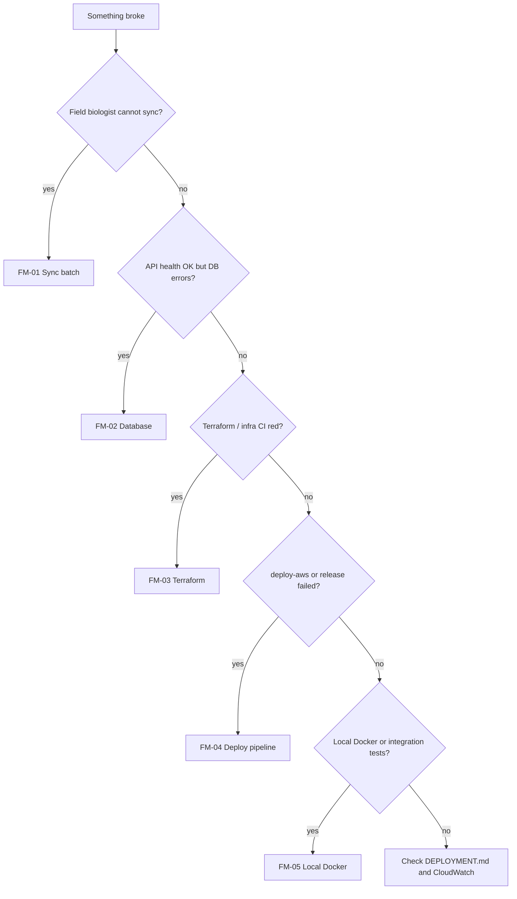

# Failure modes overview

Top operational failure modes for MMAP, ranked by **impact × likelihood** across application behavior, AWS infrastructure, and CI/CD. Each mode has an independent runbook under [runbooks/](runbooks/).

## Scope

| Domain               | Examples in this repo                                                                 |
| -------------------- | ------------------------------------------------------------------------------------- |
| Application          | Offline-first field sync, API health, schema validation, PostgreSQL persistence       |
| Infrastructure       | Terraform remote state, RDS + Secrets Manager, App Runner, CloudFront `/v1` routing   |
| Continual deployment | GitHub Actions CI, infra apply pipelines, `deploy-aws` (ECR, migrations, static sync) |

## Top 5 failure modes

| ID    | Domain                       | Failure mode                                               | Typical symptoms                                                                                                     | Severity                                 | Runbook                                                                         |
| ----- | ---------------------------- | ---------------------------------------------------------- | -------------------------------------------------------------------------------------------------------------------- | ---------------------------------------- | ------------------------------------------------------------------------------- |
| FM-01 | Application                  | Field sync batch failure or API unreachable                | Assessments stuck `pending`/`error`; Sync page shows failed queue entries; `last_error` after 5 attempts             | **High** — field data not in central DB  | [FM-01-sync-batch-failure.md](runbooks/FM-01-sync-batch-failure.md)             |
| FM-02 | Application + Infrastructure | PostgreSQL / `DATABASE_URL` / Secrets Manager connectivity | API `/v1/public/*` returns 503; sync/migrations fail; App Runner unhealthy after deploy                              | **Critical** — API cannot persist data   | [FM-02-database-connectivity.md](runbooks/FM-02-database-connectivity.md)       |
| FM-03 | Infrastructure               | Terraform plan/apply failure or state lock                 | CI `terraform-plan` or `infra-deploy` red; `Error acquiring the state lock`; staging blocked, production not reached | **High** — infra changes stuck           | [FM-03-terraform-state-or-apply.md](runbooks/FM-03-terraform-state-or-apply.md) |
| FM-04 | Continual deployment         | GitHub Actions deploy pipeline failure                     | `deploy-aws` fails on build, ECR push, migrations, or App Runner step; static sites updated but API old/missing      | **High** — users see wrong app/API combo | [FM-04-deploy-pipeline-failure.md](runbooks/FM-04-deploy-pipeline-failure.md)   |
| FM-05 | Application (local)          | Docker Compose / integration test environment failure      | `docker compose up` unhealthy; CI integration job fails; tests skip with missing `DATABASE_URL`                      | **Medium** — blocks dev and merge        | [FM-05-local-docker-integration.md](runbooks/FM-05-local-docker-integration.md) |

## Severity legend

| Level    | Meaning                                                         |
| -------- | --------------------------------------------------------------- |
| Critical | Production data path broken or at risk; respond immediately     |
| High     | Degraded service or blocked releases; respond same business day |
| Medium   | Developer/CI friction; fix before merge or next deploy          |

## When to use which runbook

## Related docs

- [DEPLOYMENT.md](DEPLOYMENT.md) — promotion checklist and rollback
- [INFRA_PIPELINES.md](INFRA_PIPELINES.md) — Terraform CI setup
- [AWS_INFRA.md](AWS_INFRA.md) — architecture and secrets flow
- [SECURITY_REMEDIATION.md](SECURITY_REMEDIATION.md) — tracked security findings
- [../DEVELOPMENT.md](../DEVELOPMENT.md) — local setup and troubleshooting
