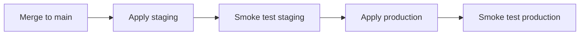

# Infrastructure CI/CD pipelines

GitHub Actions workflows for AWS Terraform bootstrap, plan, and progressive deploy.

## Workflows

| Workflow                                                                     | Trigger                               | Purpose                                                            |
| ---------------------------------------------------------------------------- | ------------------------------------- | ------------------------------------------------------------------ |
| [infra-bootstrap.yml](../../.github/workflows/infra-bootstrap.yml)           | Manual (`workflow_dispatch`)          | One-time S3 state bucket, DynamoDB lock table, Terraform OIDC role |
| [ci.yml](../../.github/workflows/ci.yml) → `terraform-plan`                  | PR + push to `main`                   | Plan staging & production; PR comment if destroys detected         |
| [infra-deploy.yml](../../.github/workflows/infra-deploy.yml)                 | Push to `main` (infra paths) + manual | Apply staging → verify → apply production (main only)              |
| [infra-staging-manual.yml](../../.github/workflows/infra-staging-manual.yml) | Manual                                | Apply **staging only** from any branch/ref                         |

## One-time setup

### 1. GitHub Environments

Create environments in **Settings → Environments**:

| Environment  | Protection                                             |
| ------------ | ------------------------------------------------------ |
| `bootstrap`  | Required reviewers: repository **admins only**         |
| `staging`    | Optional reviewers; deploy secrets (see below)         |
| `production` | Required reviewers recommended before production apply |

After the first Terraform apply per environment, add GitHub secrets from `terraform output`:

| Secret                | Terraform output                   |
| --------------------- | ---------------------------------- |
| `DATABASE_SECRET_ARN` | `database_secret_arn`              |
| `AWS_DEPLOY_ROLE_ARN` | `github_deploy_role_arn`           |
| `WEB_STATIC_BUCKET`   | `web_static_bucket`                |
| `FIELD_STATIC_BUCKET` | `field_static_bucket`              |
| `WEB_CLOUDFRONT_ID`   | `web_cloudfront_distribution_id`   |
| `FIELD_CLOUDFRONT_ID` | `field_cloudfront_distribution_id` |

Do **not** store a plaintext `DATABASE_URL` in GitHub.

### 2. Bootstrap secrets (environment: `bootstrap`)

| Secret                            | Description                                                          |
| --------------------------------- | -------------------------------------------------------------------- |
| `AWS_BOOTSTRAP_ACCESS_KEY_ID`     | IAM user/role access key with permission to create S3, DynamoDB, IAM |
| `AWS_BOOTSTRAP_SECRET_ACCESS_KEY` | Matching secret key                                                  |

Run **Infra bootstrap** from Actions (admin only). Copy outputs into repository secrets:

| Secret                   | From bootstrap output    |
| ------------------------ | ------------------------ |
| `AWS_TERRAFORM_ROLE_ARN` | `terraform_ci_role_arn`  |
| `TF_STATE_BUCKET`        | `terraform_state_bucket` |
| `TF_LOCK_TABLE`          | `terraform_lock_table`   |

### 3. Enable Terraform CI jobs

Set repository variable **`TF_INFRA_ENABLED`** = `true` (Settings → Secrets and variables → Actions → Variables).

Optional variable **`AWS_REGION`** (default `us-east-1`).

### 4. Environment isolation

- **Separate state files:** `staging/terraform.tfstate` and `production/terraform.tfstate` in the same S3 bucket
- **Separate AWS resources:** all names prefixed with `mmap-staging` vs `mmap-production`
- Staging apply (including manual from feature branches) never writes production state

## Progressive deploy flow



Production apply runs **only** when:

- Trigger is `push` to `main` (or manual dispatch on `main`)
- Staging apply and smoke test succeeded
- `TF_INFRA_ENABLED=true`

## Destroy warnings

On pull requests, CI runs `terraform plan` for **both** environments. If either plan includes `delete` actions, the workflow:

1. Posts a warning comment on the PR
2. Emits a GitHub Actions warning annotation

The plan job does not fail solely because of destroys — review is human-driven.

## Manual staging from a feature branch

1. Actions → **Infra staging (manual)** → Run workflow
2. Optionally set **git_ref** to your branch name
3. Only `staging/terraform.tfstate` is updated

Use this to validate infra changes before merging to `main`.

## Local operator commands

```powershell
# After bootstrap, init staging locally
pnpm exec tsx scripts/terraform-init.ts `
  infra/terraform/environments/staging `
  YOUR-STATE-BUCKET `
  staging/terraform.tfstate `
  us-east-1 `
  YOUR-LOCK-TABLE

terraform -chdir=infra/terraform/environments/staging plan -var-file=terraform.tfvars
```

All infra helper scripts are **TypeScript** (`scripts/terraform-*.ts`) and run on Windows PowerShell and Linux CI — no bash required.

## Related

- [AWS_INFRA.md](AWS_INFRA.md) — architecture
- [DEPLOYMENT.md](DEPLOYMENT.md) — promotion checklist
- [FAILURE_MODES.md](FAILURE_MODES.md) — incident runbooks
- [SECURITY_REMEDIATION.md](SECURITY_REMEDIATION.md) — tracked security findings
- [../../infra/bootstrap/README.md](../../infra/bootstrap/README.md) — bootstrap module
