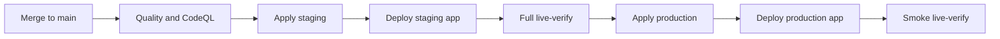

# Infrastructure CI/CD pipelines

GitHub Actions workflows for AWS Terraform bootstrap, plan, progressive CD, and manual staging release.

## Workflows

| Workflow                                                           | Trigger                      | Purpose                                                                                        |
| ------------------------------------------------------------------ | ---------------------------- | ---------------------------------------------------------------------------------------------- |
| [infra-bootstrap.yml](../../.github/workflows/infra-bootstrap.yml) | Manual (`workflow_dispatch`) | One-time S3 state bucket, DynamoDB lock table, Terraform OIDC role, ECS service-linked role    |
| [ci.yml](../../.github/workflows/ci.yml)                           | Pull request → `main`        | Quality, CodeQL, build, integration, Terraform plan (staging + production); destroy warnings   |
| [cd.yml](../../.github/workflows/cd.yml)                           | Push → `main`                | Progressive infra+app: staging apply → app → full live-verify → production apply → app → smoke |
| [release-staging.yml](../../.github/workflows/release-staging.yml) | Manual                       | Staging infra+app+full live-verify from any branch/ref (does not touch production)             |
| [deploy-aws.yml](../../.github/workflows/deploy-aws.yml)           | Manual                       | Emergency app-only redeploy to staging or production (infra must already exist)                |

Reusable workflows (called by CD / release / deploy):

| Workflow                                                     | Role                                                                     |
| ------------------------------------------------------------ | ------------------------------------------------------------------------ |
| [`_deploy-app.yml`](../../.github/workflows/_deploy-app.yml) | `turbo build --filter` web+field (and workspace deps), S3, ECR, ECS      |
| [`_verify-env.yml`](../../.github/workflows/_verify-env.yml) | Hibernate resume (staging), readiness probe, `live-verify` full or smoke |

## One-time setup

### 1. GitHub Environments

Create environments in **Settings → Environments**:

| Environment  | Protection                                     |
| ------------ | ---------------------------------------------- |
| `bootstrap`  | Required reviewers: repository **admins only** |
| `staging`    | Optional reviewers; deploy secrets (see below) |
| `production` | Optional reviewers (CD promotes automatically) |

After the first Terraform apply per environment, add GitHub secrets from `terraform output`:

| Secret                        | Terraform output                 | Notes                                                                                   |
| ----------------------------- | -------------------------------- | --------------------------------------------------------------------------------------- |
| `AWS_DEPLOY_ROLE_ARN`         | `github_deploy_role_arn`         |                                                                                         |
| `DATABASE_SECRET_ARN`         | `database_secret_arn`            | Injected into ECS as `DATABASE_URL`                                                     |
| `API_ADMIN_TOKEN_SECRET_ARN`  | `admin_token_secret_arn`         | Injected into ECS as `API_ADMIN_TOKEN`                                                  |
| `DB_HOST`                     | `db_endpoint`                    | Non-secret RDS hostname                                                                 |
| `DB_PORT`                     | `db_port`                        | Usually `5432`                                                                          |
| `DB_NAME`                     | `db_name`                        | Usually `mmap`                                                                          |
| `API_SERVICE_URL`             | `api_service_url`                | Used for post-deploy `/v1/health` wait                                                  |
| `API_CORS_ORIGIN`             | (optional)                       | Comma-separated origins; empty OK                                                       |
| `ECS_SERVICE_NAME`            | `ecs_service_name`               |                                                                                         |
| `ECS_EXECUTION_ROLE_ARN`      | `ecs_execution_role_arn`         |                                                                                         |
| `ECS_INFRASTRUCTURE_ROLE_ARN` | `ecs_infrastructure_role_arn`    |                                                                                         |
| `ECS_TASK_ROLE_ARN`           | `ecs_task_role_arn`              |                                                                                         |
| `WEB_STATIC_BUCKET`           | `web_static_bucket`              |                                                                                         |
| `FIELD_STATIC_BUCKET`         | `field_static_bucket`            |                                                                                         |
| `WEB_CLOUDFRONT_ID`           | `web_cloudfront_distribution_id` | Update after CDN create/replace; CD also passes the id from terraform apply into deploy |

Do **not** store a plaintext `DATABASE_URL` in GitHub. After a CloudFront distribution is **replaced**, refresh `WEB_CLOUDFRONT_ID` (and drop obsolete `FIELD_CLOUDFRONT_ID` if present) or emergency **Deploy AWS** invalidation will `AccessDenied` against the old id.

### 2. Bootstrap secrets (environment: `bootstrap`)

| Secret                            | Description                                                          |
| --------------------------------- | -------------------------------------------------------------------- |
| `AWS_BOOTSTRAP_ACCESS_KEY_ID`     | IAM user/role access key with permission to create S3, DynamoDB, IAM |
| `AWS_BOOTSTRAP_SECRET_ACCESS_KEY` | Matching secret key                                                  |

Run **Infra bootstrap** from Actions (admin only). Copy outputs into repository secrets:

| Secret                   | From bootstrap output    |
| ------------------------ | ------------------------ |
| `AWS_TERRAFORM_ROLE_ARN` | `terraform_ci_role_arn`  |
| `TF_STATE_BUCKET`        | `terraform_state_bucket` |
| `TF_LOCK_TABLE`          | `terraform_lock_table`   |

Bootstrap also creates **`AWSServiceRoleForECS`**, an account-wide prerequisite for ECS Express Gateway services. If that role already exists, import it into bootstrap state before re-running bootstrap (see [infra/bootstrap/README.md](../../infra/bootstrap/README.md)).

### 3. Enable Terraform CI / CD jobs

Set repository variable **`TF_INFRA_ENABLED`** = `true` (Settings → Secrets and variables → Actions → Variables).

When unset, PR **Terraform plan** still succeeds (explicit skip) so the required status check does not block merges; CD deploy jobs are skipped.

Optional variable **`AWS_REGION`** (default `us-east-1`).

### 4. Environment isolation

- **Separate state files:** `staging/terraform.tfstate` and `production/terraform.tfstate` in the same S3 bucket
- **Separate AWS resources:** all names prefixed with `mmap-staging` vs `mmap-production`
- Manual **Release staging** never writes production state

## Progressive CD flow


```mermaid
flowchart LR
  merge[Merge to main] --> quality[Quality and CodeQL]
  quality --> stgTf[Apply staging]
  stgTf --> stgApp[Deploy staging app]
  stgApp --> stgVerify[Full live-verify]
  stgVerify --> prodTf[Apply production]
  prodTf --> prodApp[Deploy production app]
  prodApp --> prodSmoke[Smoke live-verify]
```

Production apply/deploy runs **only** when:

- Trigger is `push` to `main`
- Quality, CodeQL, build, and integration succeeded
- Staging apply, app deploy, and **full** live-verify succeeded
- `TF_INFRA_ENABLED=true`

**Staging verify** runs `staging-hibernate.ts resume`, then `terraform-smoke-test.ts` (ALB/task readiness), then `live-verify.ts staging --mode full` (health, DB stats, sync write/readback, CSV). Production uses `--mode smoke` (read paths only — no mutating sync).

## Plan locking and concurrency

- **Plans never acquire the DynamoDB state lock** — `scripts/terraform-plan.ts` always passes `-lock=false`. CI plan jobs do **not** use the `mmap-terraform` concurrency group, so they never queue behind or block applies.
- **Applies serialize** via GitHub Actions concurrency group `mmap-terraform` (`cancel-in-progress: false`) on:
  - `cd.yml` → staging/production terraform apply jobs
  - `release-staging.yml` → staging terraform apply job

A plan that runs during an apply may see mid-apply state; that is acceptable for PR review. Applies still take the DynamoDB lock normally.

## Destroy warnings

On pull requests, CI runs `terraform plan` for **both** environments (after quality + CodeQL). If either plan includes `delete` actions, the workflow:

1. Posts a warning comment on the PR
2. Emits a GitHub Actions warning annotation

The plan job does not fail solely because of destroys — review is human-driven.

## Manual staging release

1. Actions → **Release staging** → Run workflow
2. Optionally set **git_ref** to your branch name
3. Applies staging Terraform, deploys the app, runs full live-verify
4. Only `staging/terraform.tfstate` is updated; production is untouched

Use this to validate infra+app changes before merging to `main`.

## Local operator commands

```powershell
# After bootstrap, init staging locally
pnpm exec tsx scripts/terraform-init.ts `
  infra/terraform/environments/staging `
  YOUR-STATE-BUCKET `
  staging/terraform.tfstate `
  us-east-1 `
  YOUR-LOCK-TABLE

terraform -chdir=infra/terraform/environments/staging plan -var-file=terraform.tfvars

# Post-deploy verification (after terraform init for the env)
pnpm exec tsx scripts/terraform-smoke-test.ts staging
pnpm exec tsx scripts/live-verify.ts staging --mode full
```

Cut staging cost without destroying the stack (scales API to 0 tasks, stops RDS):

```powershell
pnpm exec tsx scripts/staging-hibernate.ts status
pnpm exec tsx scripts/staging-hibernate.ts hibernate
pnpm exec tsx scripts/staging-hibernate.ts resume
```

See [AWS_INFRA.md](AWS_INFRA.md#hibernate-staging-scale-to-zero) for the ~$25/mo hibernated floor and caveats.

All infra helper scripts are **TypeScript** (`scripts/terraform-*.ts`, `scripts/live-verify.ts`, `scripts/staging-hibernate.ts`) and run on Windows PowerShell and Linux CI — no bash required.

## Related

- [AWS_INFRA.md](AWS_INFRA.md) — architecture
- [DEPLOYMENT.md](DEPLOYMENT.md) — promotion checklist
- [FAILURE_MODES.md](FAILURE_MODES.md) — incident runbooks
- [SECURITY_REMEDIATION.md](SECURITY_REMEDIATION.md) — tracked security findings
- [../../infra/bootstrap/README.md](../../infra/bootstrap/README.md) — bootstrap module
