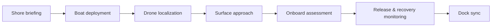

> **Advisor review:** Placeholders marked `[CMARI REVIEW]` should be validated with Jamal Galves and the CMARI field team before production use.

## Overview

This guide describes the CMARI-style Belize manatee assessment workflow supported by the Marine Mammal Assessment Platform (MMAP). It is written for biologists and field technicians using the offline field app on tablets during multi-boat operations.

## Pre-capture coordination

Before animals are approached:

- Confirm daily objectives, boat assignments, and communication channels with the lead biologist `[CMARI REVIEW]`.
- Verify drone spotters and surface teams share a common naming scheme for animals (e.g., `Belize-2026-014`).
- Charge tablets and confirm the field app opens offline before leaving shore Wi‑Fi.
- Export a local JSON backup from **Settings** if prior-day data must remain on device.

## Capture and onboard safety

- Only trained handlers should restrain animals; maintain clear roles for timer, recorder, and veterinarian `[CMARI REVIEW]`.
- Record GPS at the capture location as soon as the animal is secured alongside the vessel.
- If GPS is unavailable, enter the last known drone fix and add a note describing the fallback.

## Assessment order and multiple readings

Record vitals as soon as practical after capture. Multiple readings are encouraged when conditions allow—trends matter more than a single value.

| Measurement          | When to record       | Notes                              |
| -------------------- | -------------------- | ---------------------------------- |
| Heart rate           | Early in restraint   | Repeat every 5–10 minutes if safe  |
| Respiratory rate     | With heart rate      | Count over 30–60 seconds           |
| Internal temperature | After initial vitals | Document probe placement           |
| External temperature | Alongside internal   | Shade/air exposure note            |
| Blood pressure       | When cuff fits       | Record systolic/diastolic together |
| Length               | Before release prep  | Use consistent landmarks           |
| Weight               | If scale available   | Optional when logistics allow      |

Soft warnings in the app flag values outside expected ranges; confirm before saving if you trust the reading.

## Data entry on tablet

1. Tap **New Assessment** and enter the animal identifier used by the field team.
2. Capture GPS at the assessment location (or enter coordinates manually).
3. Add measurements from the detail screen—each type allows unlimited readings.
4. Complete the assessment when the animal is released by setting **Assessment ended** time.
5. While offline, the header shows pending sync count. At dock Wi‑Fi, tap **Sync Now** or wait for automatic sync.

## Sync and backup

- Sync uploads assessments and measurements to the research API using client UUIDs; duplicate uploads are safe.
- If sync fails, review errors under **Settings → Sync** and retry.
- Export a JSON backup before long offline periods or device handoff.

## Public dataset note

Published open data may pseudonymize assessment names. Internal field identifiers remain available in secured exports `[CMARI REVIEW]`.

## Support

- Field app help: tap the **?** icon in the header or Settings
- Technical issues: see [Contributing](../../CONTRIBUTING.md) and GitHub issues
